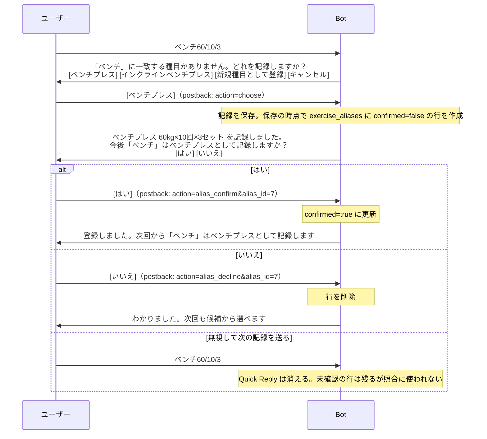

# 種目名エイリアスの保持方法と学習方式の決定（仕様書 10 章 #17 / plan.md 10.2b）

LINE で `ベンチ60/10/3` のように略称で記録するとき、「ベンチ ＝ ベンチプレス」という対応をどう扱うかを決めた記録。
plan.md 10.2（Quick Reply の上限確認）の議論中に派生し、2026-10-06 に決定した。

- ステータス: **決定済み（2026-10-06・ユーザー承認・仕様書 版 3.4）**。末尾の「決定」欄を参照
- Quick Reply の上限とボタン構成は [`docs/line-quick-reply-limits.md`](./line-quick-reply-limits.md)、候補検索の方式は [`docs/exercise-candidate-search.md`](./exercise-candidate-search.md)

---

## 1. 議論の経緯

決定に至るまでのやり取りを、論点ごとに残す。

### Q1. 「ベンチ」と送ると毎回 Quick Reply で聞かれるのか

**はい、10.2 時点の仕様のままだと毎回聞かれる。** `ベンチ` は完全一致しないので候補提案に入り、候補を選んでも「ベンチ ＝ ベンチプレス」という対応はどこにも残らないため。

仕様書 10 章 #17「種目名エイリアスの保持方法」が未決定で、「Stage 1 では候補提案で代替できる」と先送りされていたが、実運用で略称を主に使うなら代替になっていない。保留テーブル（10.3）のスキーマを決める前に、ここで一緒に決めることにした。

当初の提案は「候補を選んだときに自動で別名として記憶する」。

### Q2. 「ベンチ」が指す種目は人や日によって変わるので、記憶しない方がよいか

懸念は正当（`ベンチ` がダンベルベンチプレスを指す人もいる。同じ人でも日によって変わり得る）。一方で「記憶しない」にも避けられないコストがある。

| 案 | 利点 | 欠点 |
|---|---|---|
| 記憶しない | 毎回選ぶので取り違えが起きない。意味が日によって変わっても対応できる | 略称を使う限り 1 メッセージごとに 1 タップ増える。都度送信（1 セットごとに送る）だと毎セット聞かれ、短縮記法を採用した「速く記録する」動機とぶつかる |
| 自動で記憶（＋通知の 1 行を添える折衷案） | 聞かれるのは別名ごとに最初の 1 回だけ | 「今日のベンチはダンベル」のつもりで送ると黙ってバーベルのベンチプレスに保存される。LINE から解除できず、Web 画面が無い Stage 1 では「別名を書き分ける」以外に抜け道が無い（ロックイン） |

この時点では「自動で記憶（折衷案）」を推奨していた。取り違えはエコーバックで即座に見え、Web で直せ、書き分けで避けられるのに対し、記憶しない場合のタップ増は毎回必ず発生するため。

### Q3. 「今後 ベンチ はベンチプレスとして記録しますか」[はい][いいえ] と確認するのはどうか

ユーザーからの提案。評価の結果、**折衷案より筋が良い**と判断し、こちらを採用した。

タップ数の比較（1 記録あたりの追加タップ。「安定して使う人」は `ベンチ` が常にベンチプレスの意味、「意味が変わる人」は日によって異なる人）:

| 案 | 安定して使う人 | 意味が変わる人 |
|---|---|---|
| 記憶しない | 毎回 1 | 毎回 1 |
| 自動で記憶（折衷案） | 初回 1、以後 0 | 初回 1、以後 0 だが黙って誤記録。取り消せない |
| **確認案（はい／いいえ）** | **初回 2、以後 0** | **毎回 1（確認を無視する）** |

確認案の本質的な利点は次の 3 点。

- **別名の登録が明示的な操作になる。** 仕様書 4.3.1 の「ユーザーの明示的な操作なしに新規種目を作成しない」と同じ原則で、別名も暗黙に増えない
- **確認は記録を一切ブロックしない。** 候補選択は保存の前に挟まるので無視できないが、確認は保存後に出るので無視してよい。無視すれば次のメッセージで Quick Reply が消え、別名は作られない。「無視 ＝ いいえ」が LINE の仕組みから自然に成立する
- **誤記録を事前に防げる。** 折衷案は事後対応（エコーバックで気づいて Web で直す）だが、確認案はそもそも別名が作られない

デメリットと、設計で潰したもの:

| デメリット | 対処 |
|---|---|
| 初回のタップが 2 回になる | 別名ごとに 1 回だけ。使う種目の数（十数個）で打ち止めなので許容 |
| 都度送信で確認を見ずに次のセットを打つと、確認が消えて別名が未登録のまま | 次のセットでまた候補選択になり、確認が再び出る。エコーバックと同じ画面に出るので見逃し続けることは考えにくい |
| 確認を独立メッセージにすると、無視する人の会話に毎回 1 通余計な Bot メッセージが溜まる | **エコーバックの末尾に 1 行足し、その同じメッセージに Quick Reply を付ける。** メッセージ数は増えない。Quick Reply は最後のメッセージにしか付かない制約とも整合する |
| 「いいえ」の意味を決める必要がある | 下記 Q4 |
| 10.6 の実装範囲が広がる（postback の種類が 1 つ増える） | 別名テーブルは折衷案でも必要なので、差分は確認のやり取り分だけ |
| 未知種目が複数あるとき（10.7）、確認は Quick Reply が 1 つしか出せない | 1 別名ずつ順に出す。はい／いいえ の返信に次の確認を乗せる |

### Q4. 「いいえ」を記憶するか（「Stage 1 では記憶しない方を推奨」の意味）

**別名そのものは記憶する。記憶しないのは「いいえ」という回答の方。** 2 つは別の話なので整理する。

| 対象 | Stage 1 の決定 | 意味 |
|---|---|---|
| 別名（ベンチ ＝ ベンチプレス） | **記憶する**。ただし自動ではなく、ユーザーが はい を押したときだけ | 2 回目以降は Quick Reply なしで保存できる |
| 「いいえ」という回答 | **記憶しない** | いいえ を押しても「この略称は別名にしない」というフラグは残さない。次に同じ略称で候補を選べば、また確認が出る |

いいえ を記憶しない理由:

- 記憶すると、気が変わったときに LINE から戻す手段が無く、Web 画面が無い Stage 1 ではロックインになる。折衷案を避けた理由と同じ問題を逆向きに作ることになる
- 記憶しなくても、意味が変わる人は確認を無視すれば 0 タップで済む。確認はエコーバックに 1 行足すだけなので、毎回出ても会話は増えない
- いいえ ボタンは「わかりました。次回も候補から選べます」と返すだけの操作になるが、ボタンがあることで「無視していいのか」と迷わずに済む

毎回確認が出るのが煩わしいという声が出たら、Web 画面で別名を管理できるようになる段階でフラグ列を 1 つ足せば対応できる。後から追加しても後方互換を崩さない。

---

## 2. 保持方法: 別テーブル `exercise_aliases`

#17 の 3 案のうち別テーブルを採用する。

| 案 | 判定 | 理由 |
|---|---|---|
| **別テーブル `exercise_aliases`** | **採用** | 検索・一意性制約・確認状態をふつうの列と index で書ける。プリセット種目を指す別名もユーザーごとに持てる |
| exercises に別名列（配列） | 不採用 | 配列列は検索と一意性制約が書きにくい。プリセット行（user_id NULL）に対してユーザーごとの別名を持てない |
| プリセットの別名を seed で持つ | 不採用 | `ベンチ` がダンベルベンチプレスを指す人もいるなど、人によって意味が違う。ユーザーごとに学習する方が実態に合う |

### テーブル定義（仕様書 4.5 に転記済み）

| カラム | 型 | 制約 |
|---|---|---|
| id | bigint | PK |
| user_id | bigint | FK(users), NOT NULL |
| exercise_id | bigint | FK(exercises), NOT NULL（独自種目・プリセットのどちらでもよい） |
| alias | string | NOT NULL（入力された表記。確認文・Web 表示用） |
| normalized_alias | string | NOT NULL（照合用。正規化規則は 4.3.1(1)） |
| confirmed | boolean | NOT NULL, default false（false ＝ 確認待ち。照合には使わない） |
| created_at / updated_at | datetime | NOT NULL |

- unique index: `[user_id, normalized_alias]`
- index: `[exercise_id]`
- **種目を削除したら別名も一緒に削除する**（`Exercise has_many :exercise_aliases, dependent: :destroy`）。種目削除は 5.4 の種目管理画面で実装済みなので、別名付きの種目を消すと FK 違反で 500 になる状況を避けるために今決めた。使用中の種目は workout_sets の削除制限が先に効くので従来どおり消えない。ユーザー削除時も同様（`User has_many :exercise_aliases, dependent: :destroy`。プリセットを指す別名は種目側からは消えないため）

### 照合順

完全一致の検索順を「独自種目 → **独自の別名（confirmed のみ）** → プリセット」にする。別名の normalized_alias と同じ名前の独自種目を後から作った場合は独自種目が勝つ。

---

## 3. 確認のフロー

設計上の要点:

- **確認は保存の後。** 記録は候補選択の時点で確定・保存済みで、確認の結果に影響されない
- **候補選択で確定したときだけ聞く。** 「新規種目として登録」を選んだ場合は入力名そのものが種目になるので別名は不要。完全一致で保存できた場合も聞かない
- **postback の `data` には別名の行 id だけを入れる**（`action=alias_confirm&alias_id=7`）。10.2 で決めた「data にユーザー入力を含めない」と揃う。確認文や はい／いいえ の返信に出す略称と種目名は別名行（`alias`・`exercise_id`）から取る（保留エントリは保存時に消えている）
- **未確認の行は記録を保存した時点で作る。** 未知種目が複数ある場合（10.7）は全件確定後の一括保存の時点でまとめて作り、途中キャンセルでは作らない（「キャンセルで何も残さない」と揃える）
- **未確認の行の置き換えは削除＋新規作成（id 再採番）。** 同じ略称で再び候補選択したとき、古い [はい] ボタン（stale postback）が新しい選択を確定してしまわないようにする。pending_workout_entries と同じ考え方
- **該当行が無い postback**（stale・削除済み）には「この確認は無効になりました」と返す
- **未知種目が複数ある場合（10.7）**は、一括保存後のエコーバックに 1 件目の確認を付け、はい／いいえ の返信に 2 件目の確認を乗せる。無視されたら残りの確認は出ない（未確認の行は残る）

### ボタンの仕様（10.2 の上限内）

| ボタン | `label` | `displayText` | `data` |
|---|---|---|---|
| はい | 「はい」 | 「今後「ベンチ」はベンチプレスとして記録」 | `action=alias_confirm&alias_id=<id>` |
| いいえ | 「いいえ」 | 「今回は登録しない」 | `action=alias_decline&alias_id=<id>` |

`displayText` を説明的にしておくと、トーク履歴だけで何を決めたか読める。`displayText` は 300 文字が上限なので、種目名が極端に長い場合の切り詰めは 10.5 の label と同じ方針に従う。

---

## 4. 実装への申し送り

- **10.2c（新規）**: `exercise_aliases` の作成と、完全一致検索（9.3 の `Exercise` class method）への別名の組み込み。model spec で「confirmed の別名は一致する」「未確認の別名は一致しない」「同名の独自種目が別名より優先される」を確認する
- **10.6**: 候補選択（`choose`）で確定した種目について、保存の時点で未確認の別名行を作成し、エコーバックに確認の 1 行と Quick Reply を付ける。`alias_confirm` / `alias_decline` / stale の 3 ケースを request spec に追加する
- **10.7**: 複数別名の順次確認
- **確定した別名の解除手段は Stage 1 では持たない**（ユーザー決定 2026-10-06）。はい で確定した略称は完全一致するため候補提案に入らず、LINE からは解除できない。それまでは正式名称で送れば回避できる。解除は将来の Web の別名管理画面（一覧・削除）か LINE コマンドで行い、別名は 1 行のデータなのでデータ構造を変えずに後から追加できる
- 漢字/カタカナ違い（懸垂/ケンスイ）や略号（`DL`）も、候補検索（pg_trgm）で拾えれば同じ仕組みで別名になる。拾えない場合はコマンド（`別名 DL=デッドリフト` 等）での登録を 11 章で検討する余地があるが、Stage 1 の範囲には入れない

---

## 5. 決定

| 項目 | 決定 | 日付 |
|---|---|---|
| 別名を記憶するか | **記憶する**。ただし候補選択後の確認で はい を押したときだけ（確認案） | 2026-10-06 |
| 「いいえ」の扱い | **記憶しない**。行を削除し、次回また確認が出る | 2026-10-06 |
| 保持方法 | **別テーブル `exercise_aliases`**（unique `[user_id, normalized_alias]`、`confirmed` 列） | 2026-10-06 |
| 確認の出し方 | **エコーバックの末尾に 1 行＋同じメッセージに Quick Reply [はい] [いいえ]**。独立メッセージにしない | 2026-10-06 |
| 照合順 | 独自種目 → 独自の別名（confirmed） → プリセット | 2026-10-06 |

plan.md 10.2b（決定）・10.2c（テーブル作成と照合への組み込み）と仕様書（版 3.4: 4.2.1・4.2.3・4.3.1(2)(4)・4.5・10 章 #17）に反映済み。
