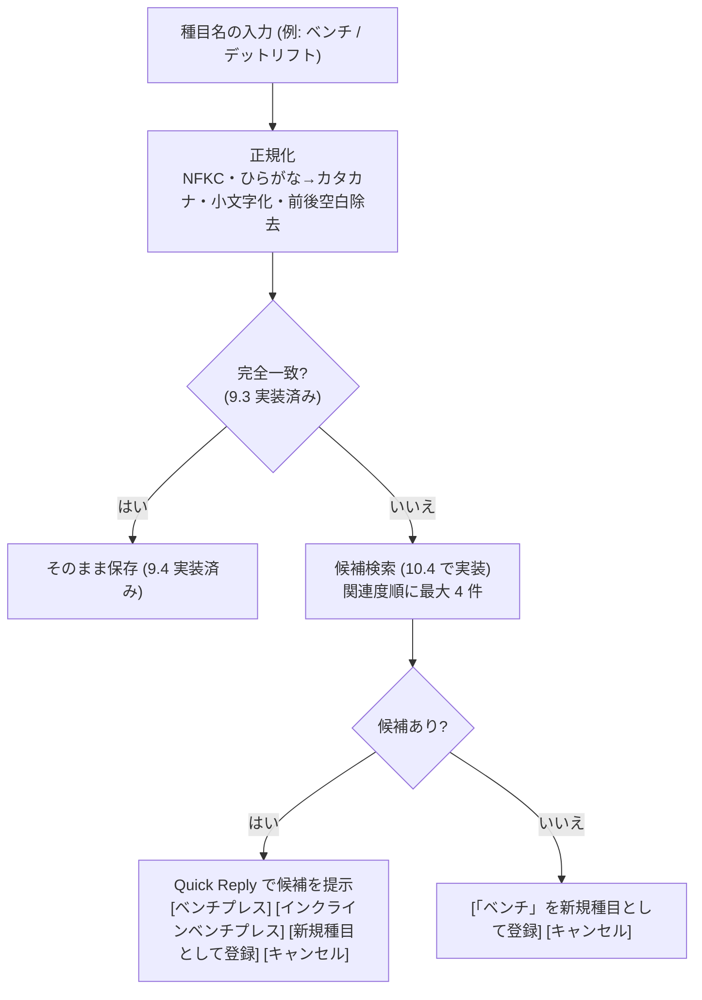

# 種目候補検索の方式決定（plan.md 10.1）

LINE で送られた種目名が登録済みの種目と完全一致しなかったとき、どうやって「近い種目」を探すかを決める資料。
plan.md 10.1「pg_trgm の採否と閾値方針」の調査内容と、決定のための材料をまとめる（2026-10-05 調査）。

- ステータス: **決定済み（2026-10-06・案 B・閾値 0.25）**。末尾の「決定」欄を参照
- 前提知識は不要。LINE 入力の全体像は [`docs/line-record-flow.md`](./line-record-flow.md)

---

## 1. なにを決めるのか

LINE に `ベンチ60/5/3` と送ると、アプリは種目名 `ベンチ` を種目マスタ（プリセット 22 件＋自分で登録した種目）から探す。流れは仕様書 4.3.1 で次のように決まっている。



10.1 が決めるのは **「候補検索」の中身**。仕様書は次の 2 段構えを想定している。

1. **前方一致・部分一致**（確定済み）: `ベンチ` → `ベンチプレス`、`インクラインベンチプレス`
2. **類似度検索**（想定のみ・採否未定）: 1 で足りないときに、文字列の「似ている度合い」で探す。PostgreSQL の拡張 pg_trgm を使う想定

つまり決めることは 2 つ。

- 類似度検索を入れるか（pg_trgm を採用するか）
- 入れるなら「どのくらい似ていれば候補にするか」の閾値の初期値

---

## 2. なぜ類似度検索が要るのか

### 前方一致・部分一致で足りるもの: 略称

プリセット 22 件に対して、略称 13 種を試した結果、**すべて前方一致か部分一致で正解を含む**。

| 入力 | 前方一致 | 部分一致 | 正解 |
|---|---|---|---|
| ベンチ | 1 件 | 2 件 | ベンチプレス（＋インクラインベンチプレス） |
| デッド | 1 | 1 | デッドリフト |
| ラットプル | 1 | 1 | ラットプルダウン |
| スクワ | 1 | 2 | スクワット（＋ブルガリアンスクワット） |
| レッグ | 4 | 4 | レッグプレス / カール / レイズ / エクステンション |
| プレス | 0 | **7** | ベンチプレス、ダンベルプレス、… |
| カール | 0 | 2 | レッグカール、アームカール |

`プレス` のように部分一致が上限 4 件を超える入力があるため、10.4 では「前方一致 → 部分一致 → 類似度」の順位と、同順位内の並び（名前の短い順など）を決める必要がある。

### 前方一致・部分一致で拾えないもの: 誤字

1 文字の誤字 13 種（デットリフト、ベンチブレス、サイドレイス、ラッドプルダウン、クランテ、スクワト、ディプス、リアレイス、シーテッドロウ、レッグカル、アムカール、ダンベルプレスス、腕立てふせ）は、前方一致・部分一致ともに **0 件**。

このままだと「候補なし」の分岐に入り、Quick Reply に `[「デットリフト」を新規種目として登録]` が出る。誤字が 1 タップで新しい種目になり、記録が `デッドリフト` と `デットリフト` の 2 つに分散する。これは仕様書 4.3.1 が候補提案を置いた目的（表記ゆれによる種目の乱立防止）に反する。

**類似度検索の価値は、この「誤字を正しい種目に寄せる」1 点にある。**

### どちらでも拾えないもの

- 漢字とカタカナの違い（`懸垂` と `ケンスイ`）
- 略号（`DL` → デッドリフト）

これらは文字の形が違いすぎて類似度でも拾えない。仕様書 10 章 #17「種目名エイリアス」の領分で、候補検索では解決しない。

---

## 3. pg_trgm とは

PostgreSQL に同梱されている拡張（contrib）。文字列を 3 文字ずつの断片（trigram）に分解し、2 つの文字列で共通する断片の割合を 0〜1 の `similarity()` として返す。

```
ベンチプレス → "  ベ", " ベン", "ベンチ", "ンチプ", "チプレ", "プレス", "レス " の 7 個
```

- 有効化は `CREATE EXTENSION pg_trgm`（Rails ではマイグレーションの `enable_extension "pg_trgm"` 1 行）
- PostgreSQL 13 以降は trusted extension で、DB の所有者権限で有効化できる（スーパーユーザー不要）
- 主要なマネージド PostgreSQL（RDS、Supabase、Neon、Render 等）で利用可能
- 大量データ向けに trigram index（GIN / GiST）も作れるが、必須ではない

---

## 4. 実測結果

開発用の PostgreSQL 17.10 コンテナで、トランザクション内に pg_trgm を有効化してプリセット 22 件と比較し、ロールバックした（DB には何も残していない）。

### pg_trgm `similarity()`

| 入力（誤字） | 正解の候補とスコア | 2 位以下の最大 |
|---|---|---|
| デットリフト | デッドリフト 0.40 | 0.08 |
| ベンチブレス | ベンチプレス 0.40 | 0.11 |
| サイドレイス | サイドレイズ 0.56 | 0.00 |
| ラッドプルダウン | ラットプルダウン 0.50 | 0.10 |
| クランテ | クランチ 0.43 | 0.00 |
| スクワト | スクワット 0.38 | 0.06 |
| ディプス | ディップス 0.38 | 0.09 |
| リアレイス | リアレイズ 0.50 | 0.00 |
| シーテッドロウ | シーテッドロー 0.60 | 0.06 |
| レッグカル | レッグカール 0.44 | 0.30（レッグプレス・レッグレイズ） |
| アムカール | アームカール 0.44 | 0.18 |
| ダンベルプレスス | ダンベルプレス 0.70 | 0.07 |
| 腕立てふせ | 腕立て伏せ 0.33 | 0.00 |
| ランジ（該当なし） | 最大 0.08 | |

読み方:
- 正解は 0.33〜0.70、誤りは同じ「レッグ」系を除けば 0.11 以下。**閾値で分離できる**
- カタカナの種目名は短く（6 文字なら trigram 7 個）、1 文字違いでもスコアが低めに出る。pg_trgm 既定の閾値 0.3 では `腕立てふせ`（0.33）が際どい
- `ランジ` のように存在しない種目は 0.08 止まりで、候補なしと正しく判定できる

### 比較: Ruby 標準ライブラリの Jaro-Winkler

拡張なしの代替として、Ruby に同梱されている `DidYouMean::JaroWinkler` でも測った。正解は 0.88〜0.98、誤りは最大 0.79（`レッグカル` に対する `レッグレイズ`）で、閾値 0.85 で分離できる。

---

## 5. 選択肢

| 案 | 内容 | 利点 | 欠点 |
|---|---|---|---|
| A | pg_trgm 不採用。前方一致・部分一致のみ | 実装が最小 | 誤字が新種目になりやすい（2 章） |
| B | **pg_trgm 採用**。前方一致・部分一致で 4 件に満たないとき `similarity()` で補う。index は作らない | Rails と PostgreSQL の標準的な手法。候補検索が SQL 1 か所で完結し、DB 込みの spec で検証できる | 拡張の有効化（マイグレーション 1 行）が必要。ホスティング先（仕様書 10 章 #1・未定）が対応している必要がある |
| C | Ruby 側で Jaro-Winkler（gem 追加なし） | 拡張も index も不要 | 一般的な手法ではない。`DidYouMean` は本来 CLI の入力補正用で、安定 API としての保証が弱い |

B の補足:
- 検索対象はユーザーごとに「プリセット 22 件＋独自種目」の数十行なので、trigram index は不要（全件を `similarity()` で評価して十分速い）
- 閾値はセッション設定（`pg_trgm.similarity_threshold`）ではなく、SQL に `similarity(normalized_name, ?) >= 0.25` と明示する。設定に依存せず、spec で閾値を読める

---

## 6. 推奨

**案 B（pg_trgm 採用・index なし・閾値の初期値 0.25）**

- 誤字対策の価値が明確（2 章）
- 仕様書の想定どおりで、Rails + PostgreSQL の標準的な手法として学習価値もある
- データ量から index 不要で、導入コストはマイグレーション 1 行
- 閾値 0.25 は、実測の正解最小値 0.33 に余裕を持たせつつ、同系統以外の誤り（0.11 以下）を確実に除外できる値。10.4 のテストケースで微調整する前提の初期値

---

## 7. 決定（記入欄）

| 項目 | 決定 | 日付 |
|---|---|---|
| 採否（A / B / C） | **B**（pg_trgm 採用・trigram index なし） | 2026-10-06 |
| 閾値の初期値 | **0.25**（`similarity(normalized_name, 入力) >= 0.25` を SQL に明示。10.4 のテストで微調整） | 2026-10-06 |

plan.md 10.1 と仕様書（版 3.3: 4.3.1(2)・4.5・10 章 #9）に反映済み。10.4（候補検索の実装）で extension 有効化と検索ロジックを実装する。`DL` や `懸垂/ケンスイ` のようなエイリアスは #17 として別途検討する。
