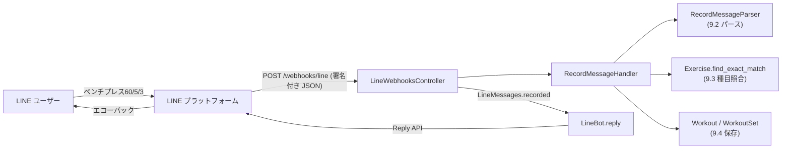
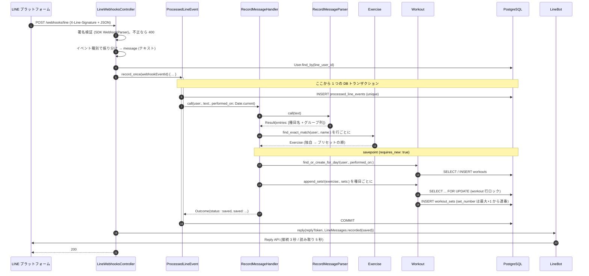
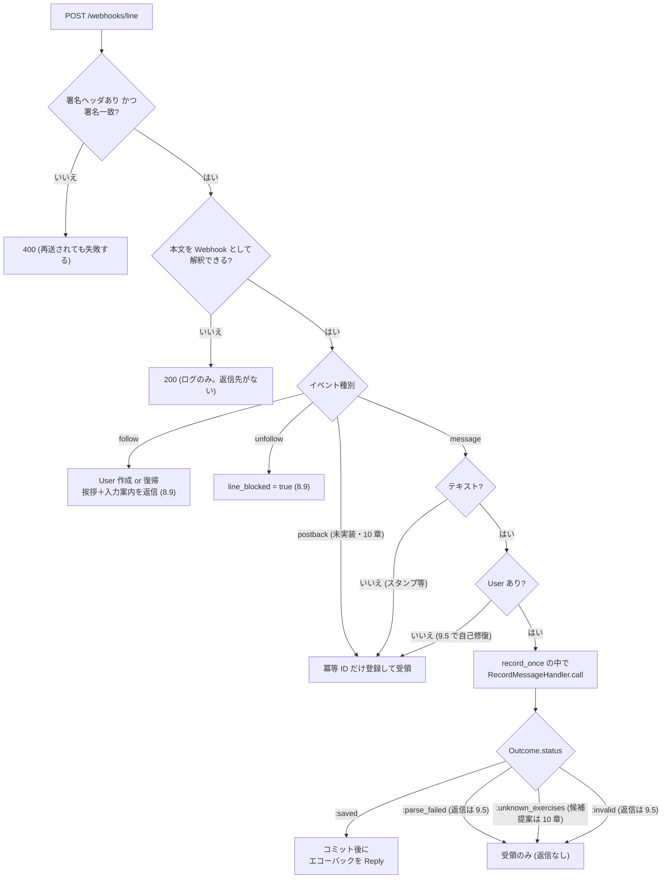
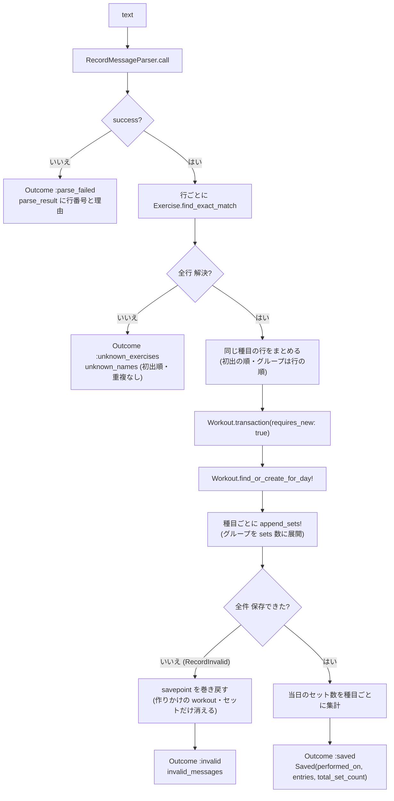
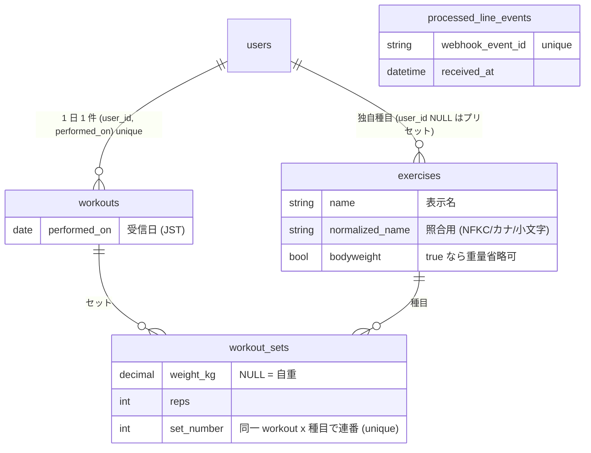
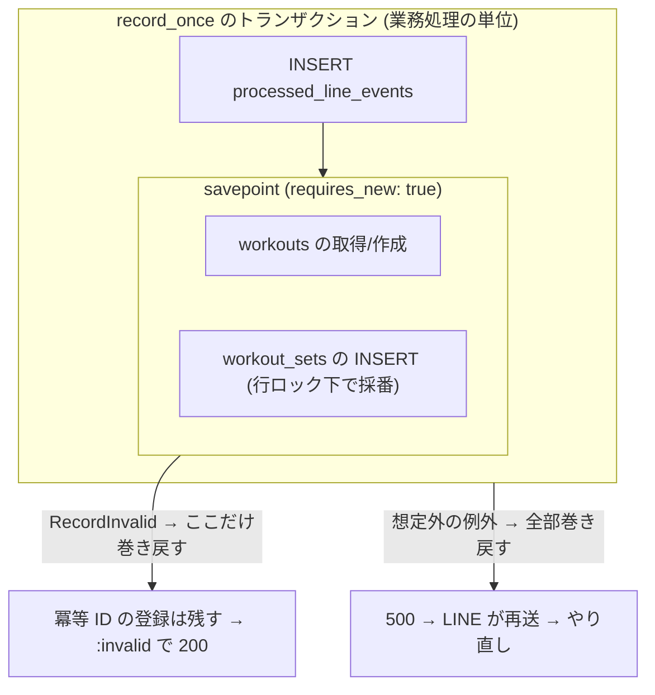
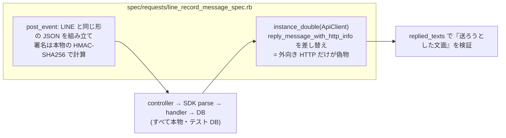

# LINE 記録入力の処理フロー（plan.md 7 章〜9.4 時点）

LINE のトークに `ベンチプレス60/5/3` と送ってから、DB に保存されてエコーバックが返るまでの流れを整理する。
対象は 2026-09-29 時点（PR #69 マージ後）の実装。仕様書の該当節は各所に付記する。

- 9.5（エラー応答）・10 章（種目候補提案）・11 章（コマンド）は未実装。現状の「受領だけして何も返さない」分岐がそれらの置き場所になる
- 図は Mermaid。GitHub 上でそのまま描画される

---

## 1. 全体像

役割分担（仕様書 2.3「ドメイン層に LINE SDK の型を渡さない」に従う）:

| 層 | ファイル | 責務 | plan |
|---|---|---|---|
| 受信 | `app/controllers/line_webhooks_controller.rb` | 署名検証・イベント振り分け・冪等性・返信の呼び出し。SDK の型はここで止める | 7.4〜7.6, 8.9, 9.4 |
| LINE API | `app/models/line_bot.rb` | SDK クライアント、Get profile、Reply（短いタイムアウト・失敗はログのみ） | 7.3, 8.9 |
| 冪等性 | `app/models/processed_line_event.rb` | `webhookEventId` の登録と業務処理を同一トランザクションで実行 | 7.5 |
| 処理 | `app/models/record_message_handler.rb` | パース → 照合 → 保存をつなぎ、結果を `Outcome` で返す | 9.4 |
| パース | `app/models/record_message_parser.rb` | 短縮記法の文字列を「種目名＋(重量, 回数, セット数)」に変換。DB に触れない | 9.2 |
| 照合 | `app/models/exercise.rb` `app/models/exercise_name_normalizer.rb` | 正規化した名前の完全一致（ユーザー独自 → プリセット） | 3.3, 9.3 |
| 保存 | `app/models/workout.rb` `app/models/workout_set.rb` | 当日 workout の取得/作成、セットの採番と一括追記 | 4.3〜4.4, 9.4 |
| 文面 | `app/models/line_messages.rb` | 挨拶・入力案内・エコーバックの文言 | 8.9, 9.4 |

---

## 2. 時系列（正常系: 記録が保存されるまで）

押さえどころ:

- **返信は COMMIT の後**（仕様書 2.3）。返信に失敗しても記録は残る。逆に保存に失敗したら返信しない
- **再送（同じ `webhookEventId`）は 6 の INSERT が unique 制約で失敗し、ブロックが実行されない**ので二重保存も再返信もない（仕様書 4.2.4）
- 業務処理中の想定外の例外は rescue しない → 500 → LINE が再送 → 冪等 ID ごとロールバックされているのでやり直せる

---

## 3. 分岐（コントローラから handler まで）

- `:parse_failed` `:unknown_exercises` `:invalid` のいずれも **何も保存しない**（仕様書 4.2.3「部分保存しない」）。複数行のうち 1 行でも該当したら全行が対象
- 上の 3 つは冪等 ID の登録だけはコミットされる。再送されても同じ結果になる「業務エラー」（4.2.4）なので 200 でよい

---

## 4. RecordMessageHandler の中身

入力 → 出力の対応例:

| 入力（1 メッセージ） | パース結果 | 保存されるセット | エコーバック |
|---|---|---|---|
| `ベンチプレス60/5/3` | ベンチプレス [60×5 ×3] | set 1〜3: 60kg×5 | `ベンチプレス 60kg×5回×3セット（本日 計3セット）` |
| `ベンチプレス60/5/2 65/5` | ベンチプレス [60×5 ×2, 65×5 ×1] | set 1,2: 60×5 / set 3: 65×5 | `ベンチプレス 60kg×5回×2セット / 65kg×5回×1セット（本日 計3セット）` |
| `懸垂/10/3` | 懸垂 [自重×10 ×3] | set 1〜3: NULL×10 | `懸垂 自重×10回×3セット（本日 計3セット）` |
| `ベンチプレス60/5` `懸垂/10/2` `ベンチプレス70/3` | 3 行 → 種目ごとにまとめる | ベンチ set 1: 60×5, set 2: 70×3 / 懸垂 set 1,2 | 1 行に並べた場合と同じ表示（PR #69 レビュー対応） |
| 同日 2 通目 `ベンチプレス70/3`（既に 3 セットあり） | ベンチプレス [70×3 ×1] | set 4: 70×3（採番が続く） | `ベンチプレス 70kg×3回×1セット（本日 計4セット）` |
| `ベンチ 60 5 3`（旧記法） | 失敗 `:missing_group` | なし | なし（9.5 で案内を返す） |
| `ベンチ60/5`（プリセットに無い略称） | 解決できず | なし | なし（10 章で候補提案） |
| `ベンチプレス/10/3`（重量必須の種目に自重） | パースは成功 → 保存で検証エラー | なし | なし（9.5 で案内を返す） |

エコーバックの決め値（9.4）: グループは合算せず個別に列挙する（`懸垂/10 /3` のような打ち間違いが見えるように）。種目ごとの「本日 計 N セット」は今回分を含む当日累計。末尾に全種目の合計

---

## 5. データとトランザクション境界

- 記録日は `Date.current`。`config.time_zone = "Tokyo"` なので JST の日付（仕様書 4.2.2。多国展開時は `users.time_zone` へ移行: 10 章 #18）
- 採番は `SELECT ... FOR UPDATE` で workout 行をロックして「最大 set_number + 1」から振る（4.4 の決定）。LINE と Web の同時入力でも重複しない
- 当日 workout の作成が別処理と競合した場合は検索し直す（`find_or_create_for_day!`）。500 にはしない

---

## 6. テストの見方（どこまでが本物で、どこがモックか）

| spec | 検証する範囲 | モック |
|---|---|---|
| `spec/models/record_message_parser_spec.rb` | 文字列 → 構造（ケース表 A1〜A17 / R1〜R14） | なし（DB も使わない） |
| `spec/models/exercise_spec.rb`（`.find_exact_match`） | 正規化名の完全一致・独自優先・他ユーザー遮断 | なし |
| `spec/models/workout_spec.rb`（`.find_or_create_for_day!` / `#append_sets!`） | 当日 workout の取得/作成・採番の継続・全件巻き戻し | 競合再現のため `find_by` だけ stub |
| `spec/models/record_message_handler_spec.rb` | 4 つの Outcome と「何も保存しない」、savepoint と外側トランザクションの関係 | なし |
| `spec/models/line_messages_spec.rb`（`.recorded`） | エコーバックの文面 | なし |
| `spec/requests/line_record_message_spec.rb` | Webhook 受信 → 保存 → 返信の通し。JST の日付・再送・コミット後の返信 | LINE への HTTP（Reply）のみ |
| `spec/requests/line_webhooks_spec.rb` / `line_follow_unfollow_spec.rb` | 署名・冪等性・エラー分類 / follow・unfollow | LINE への HTTP（Get profile / Reply）のみ |

実物の LINE で同じ流れを確認するのは 12.1（ngrok で開発環境を公開・7.7 の再送設定もここで実施）。request spec の `text_event` が組み立てている JSON は、そのとき実際に届く Webhook 本文と同じ形なので、ログと見比べると対応が取れる

---

## 7. これからの項目との接点

| 項目 | 現状の置き場所 | 追加するもの |
|---|---|---|
| 9.5 エラー応答 | `handle_message` の `:parse_failed` / `:invalid` 分岐、User なしの分岐 | 失敗行＋入力例の返信、`User.find_or_create_from_line!` による自己修復、その他テキストへのヘルプ |
| 9.6 Reply 呼び出し条件 | `LineBot.reply`（タイムアウト・失敗時ログのみは実装済み） | 失敗時に記録が残ることの spec を通しで確認 |
| 10 章 候補提案 | `:unknown_exercises` 分岐 | 候補検索・`pending_workout_entries`・Quick Reply・postback。確定後は 9.4 の保存に合流 |
| 11 章 コマンド | `handle_message` の先頭 | `ヘルプ` `今日` `履歴` の判定を handler より前に置く |
