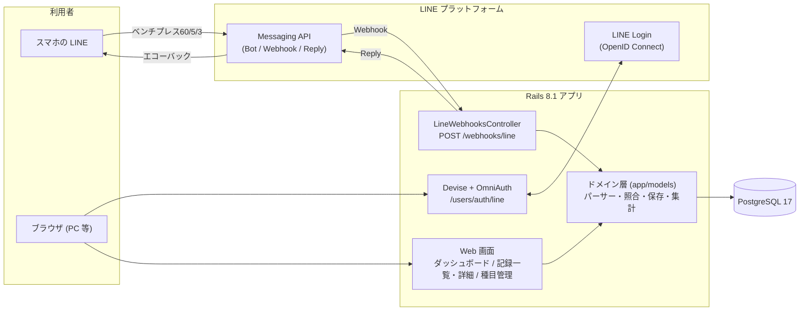
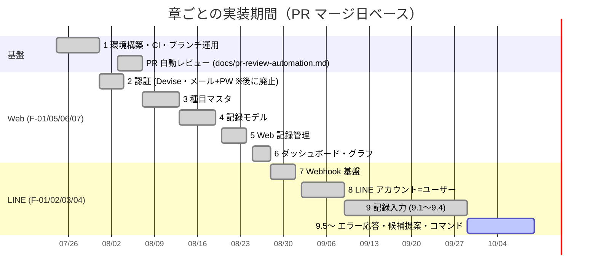
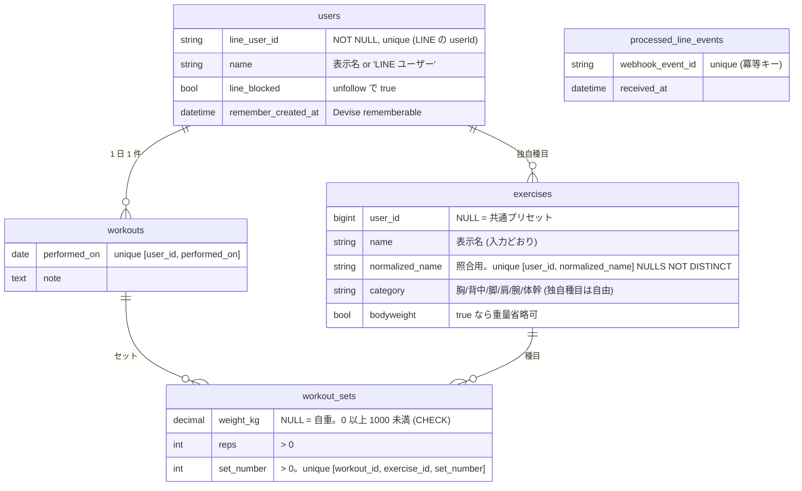
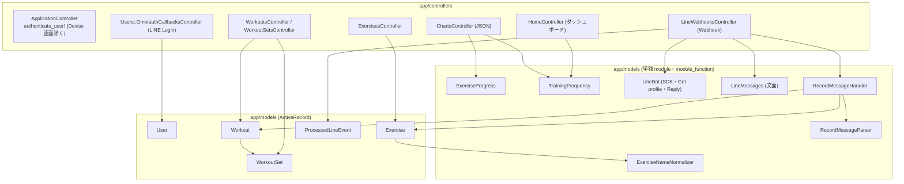

# Stage 1 実装の歩み（plan.md 1 章〜9.4）

2026-07-24 の初期コミットから 2026-09-29（PR #69 マージ）までに作ったもの・決めたことを 1 枚にまとめる。
細部は `plan.md` の各項目と仕様書（`~/plans/SPEC-workout-tracker-20260723.md` 版 3.2）に記録済み。ここは「全体がどうつながっているか」を掴むための資料。

- 現在地: **9.4 完了・次は 9.5（エラー応答）**
- 規模: 66 コミット / PR #69 まで / マイグレーション 8 本 / RSpec 328 examples（全 green）
- LINE 記録入力の詳しい流れは [`docs/line-record-flow.md`](./line-record-flow.md)

---

## 1. いま動いているもの（全体図）

- **アカウントの主体は LINE アカウント**。友だち追加か初回 LINE Login のどちらか早い方で `users` 行が自動作成される。Web はその同じアカウントを PC で詳しく見る画面（仕様書 版 3.0・2026-09-03 決定）
- LINE からは記録の**入力**、Web では記録の**閲覧・編集・種目管理・グラフ**。同じ `workouts` / `workout_sets` を両方から触る

---

## 2. タイムライン

| 章 | 期間 | PR | 成果 |
|---|---|---|---|
| 1 環境構築 | 7/24〜7/31 | #5〜#7 | Rails 8.1 / Ruby 3.3 / PostgreSQL 17（Docker）/ RSpec・FactoryBot / CI（test・lint・Brakeman・bundler-audit）/ ブランチ保護 |
| 2 認証 | 7/31〜8/4 | #8〜#11, #14 | Devise でメール＋パスワード認証、会員登録・リセットメール（**8 章で廃止**。Devise 本体は残る） |
| （運用） | 8/3〜8/7 | #12, #13, #20〜#23 | `CLAUDE.md`、PR 自動レビュー（GitHub Actions ＋ Claude Code）、`@claude` メンションレビュー |
| 3 種目マスタ | 8/7〜8/13 | #19, #21, #26, #29 | `exercises` テーブル、名前の正規化、Exercise モデル、プリセット 22 件の seed |
| 4 記録モデル | 8/13〜8/19 | #32〜#37 | `workouts` / `workout_sets` テーブル、モデル、行ロックによるセット採番、削除時の繰り上げ |
| 5 Web 記録管理 | 8/20〜8/24 | #39〜#43 | 認証必須＋ `current_user` 起点の共通基盤、記録一覧（月フィルタ）、記録詳細（セット追加・修正・削除）、種目管理、日本語化 |
| 6 ダッシュボード | 8/25〜8/28 | #44, #46, #47 | 種目別推移（最大重量・推定 1RM）と月間頻度の集計、JSON エンドポイント、Chart.js ＋ Stimulus のダッシュボード |
| 7 Webhook 基盤 | 8/28〜9/1 | #48〜#54 | LINE 制約値の確認、資格情報、SDK 導入、署名検証、冪等性（webhookEventId）、エラー分類（400/200/500） |
| 8 LINE＝ユーザー | 9/2〜9/9 | #56〜#63 | 連携コード方式を一度実装（#56〜#58）→ **LINE Login 一本化に方針転換**（#59〜#62）→ follow / unfollow 処理（#63） |
| 9 記録入力 | 9/9〜9/29 | #65〜#67, #69 | 短縮記法の確定（9.1）、パーサー（9.2）、種目照合（9.3）、保存フローとエコーバック（9.4） |

---

## 3. 章ごとの中身と主な決定

### 1. 環境構築・開発の型
- `rails new --database=postgresql --skip-test`、Ruby 3.3.10、Rails 8.1（CVE 対応で 8.1.3.1 へ）
- CI: RSpec / RuboCop（rubocop-rails-omakase）/ Brakeman / bundler-audit / importmap audit。main はブランチ保護（PR 必須・CI 必須）
- 運用ルールを文書化: `docs/branching-rules.md`（1 plan 項目 ＝ 1 ブランチ ＝ 1 PR、コミット規約）、`docs/pr-review-automation.md`（自動レビュー）、`CLAUDE.md`（AI セッション共通の規約）
- 開発の型: **TDD（RED → GREEN → REFACTOR）を全項目に適用**し、plan.md に RED の失敗理由まで記録する

### 2. 認証（当時: メール＋パスワード）
- Devise（database_authenticatable / registerable / recoverable / rememberable / validatable）で登録・ログイン・リセットメール（letter_opener）
- **2026-09-03 に廃止が決定**（8 章）。Devise 自体は `omniauthable` / `rememberable` のセッション管理として残る。当時の記録は plan.md に残置

### 3. 種目マスタ（F-06 データ層）
- `exercises`: `user_id` NULL ＝ 共通プリセット。unique index `[user_id, normalized_name]` は **`NULLS NOT DISTINCT`**（PG 15+）でプリセット同士の重複も防ぐ
- 正規化 `ExerciseNameNormalizer`: NFKC → ゼロ幅文字除去 → 前後空白除去 → ひらがな→カタカナ → 小文字。**適用順序に依存**（全角空白は NFKC 後に strip、ゼロ幅は strip より先）
- プリセットは 22 件・6 カテゴリ、正式名称・日本語のみ（略称は候補提案で拾う）。seed は **追加のみ（`find_or_create_by!`）**で冪等

### 4. 記録モデル（F-05 データ層）
- `workouts`: 1 ユーザー 1 日 1 行（unique）。`workout_sets`: 同一 workout×種目で `set_number` 連番（unique）、`weight_kg` NULL ＝ 自重、0 以上 1000 未満（DB CHECK ＋ モデル検証の二層）
- **採番は workout 行ロック（`SELECT FOR UPDATE`）**で直列化。制約違反リトライ方式は PG の中断トランザクション回復が複雑なため不採用。2 スレッドの実コミットで並行 spec を書き、`with_lock` を外すと落ちることを確認
- 削除時は後続セットを同一トランザクションで繰り上げ、歯抜けを作らない

### 5. Web 記録管理（F-05 / F-06 画面）
- **全画面 `authenticate_user!`、リソース取得は常に `current_user` 起点**（他ユーザーのデータは 404。存在有無を区別させない）
- `/workouts`（日付降順・種目数・総セット数・月フィルタ）、`/workouts/:id`（セット追加・修正・削除。修正は重量と回数のみ）、`/exercises`（独自種目の追加・改名・削除。使用中は削除不可）
- 日本語化: `rails-i18n` ＋ `devise-i18n` を導入し、アプリ固有のモデル名・属性名だけ `ja.yml` に書く
- 後回しにした UI 項目: 5.6（同名の独自種目とプリセットの区別表示）、5.7（フォームのラベル付け）

### 6. ダッシュボード・グラフ（F-07）
- 集計は `ExerciseProgress`（日付ごとの最大重量と **セットごとの e1RM の日次最大**、Epley 式）と `TrainingFrequency`（週/月の実施日数。ISO 週）。SQL の GROUP BY で行う
- `GET /charts/exercise_progress` / `GET /charts/training_frequency` が JSON を返し、Stimulus コントローラが Chart.js で描画。当週サマリ（実施日数・総セット数）は `data-summary` フックで spec 検証
- 学び: importmap の jspm ESM 版 Chart.js は相対チャンクの 404 で動かず、**UMD 単一ファイルを vendor に置く**方式に変更。Turbo / Stimulus の pin 漏れで JS が未ロードだった問題もここで発見・解消。Brakeman は**リファクタ後にも再実行する**（変数切り出しで SQL Injection 警告が出た）

### 7. LINE Webhook 基盤（F-03 前段）
- 公式ドキュメントで制約値を確認: replyToken は 1 回限り・受信後 1 分、再送 Webhook でも使える。webhookEventId は再送でも不変（冪等キーに採用）。再送は回数非公開の「安全網」
- 資格情報は Rails credentials（`line.channel_secret` / `line.channel_access_token`）。SDK は `line-bot-api` 2.x（1.x と非互換）。初期化は `LineBot` に集約、タイムアウトは接続 3 秒・読み取り 5 秒
- `POST /webhooks/line`: 署名不正 → 400 / 本文解釈不能 → 200 / 業務処理の例外 → 500（rescue しない。LINE の再送で回復）。`authenticate_user!` と CSRF の除外はここだけ
- 冪等性: `ProcessedLineEvent.record_once(id) { 業務処理 }`。ID 登録と業務処理を同一トランザクションで行い、登録済みならスキップ、例外なら登録ごとロールバック

### 8. LINE アカウント＝ユーザー（F-01 / F-02）
- 当初は「Web アカウントに LINE を後から紐付ける連携コード方式」を 8.1〜8.2b で実装したが、ユーザーの意図（友だち追加だけで記録が始まり、Web は同じアカウントを見る画面）を確認し、**Web 認証を LINE Login に一本化**（`~/plans/DECISION-line-login-unification-20260903.md`）
- `users` を再定義: email / パスワード / 連携コード列を削除、`line_user_id` NOT NULL・unique。`User.find_or_create_from_line!`（表示名が取れなければ `LINE ユーザー`、並行作成は unique 制約で吸収）
- OIDC クライアントは `omniauth_openid_connect` ＋ `omniauth-rails_csrf_protection`。LINE 固有の必須設定（HS256 明示・フォーム本文でのクライアント認証・PKCE）は spike で実測（`docs/spike-line-login-oidc-20260904.md`）。Messaging API と LINE Login は**同一プロバイダー**（userId を一致させるため）
- follow: Get profile で表示名を取得（失敗時はフォールバック名）→ User 作成 or 復帰（`line_blocked` を false）→ 挨拶＋入力案内を返信。unfollow: `line_blocked` を true（記録は消さない）

### 9. 記録入力（F-03 / F-04）
- **9.1 短縮記法のみ採用**（旧 `60kg 10回 3セット` 記法は削除）: `<種目名> <重量>/<回数>[/<セット数>] [<グループ> ...]`、自重は `懸垂/10/3`、単位は対応位置に限り任意（別名あり）、推測補正なし。受理 A1〜A17 / 拒否 R1〜R14 のケース表を確定。カンマ区切りは拒否のまま、自重 `/N` の読み間違いはエコーバックで気付いてもらう（2026-09-16）
- 9.2 `RecordMessageParser`: 純粋な変換（DB に触れない）。出力は `Result(entries, errors)`、失敗は行番号と理由コード。公開 API は `call` のみ
- 9.3 `Exercise.find_exact_match(user:, name:)`: 正規化名の完全一致、独自 → プリセットの順
- 9.4 `RecordMessageHandler` ＋ `Workout.find_or_create_for_day!` / `Workout#append_sets!` ＋ `LineMessages.recorded`: 当日 workout に一括追記し、コミット後にエコーバック。1 行でも失敗したら何も保存しない（savepoint で巻き戻し、冪等 ID の登録は残す）。同じ種目を複数行に分けても種目単位にまとめて表示（PR #69 レビュー対応）。**`config.time_zone = "Tokyo"`**（記録日は受信日 JST。多国展開時はユーザーごとの timezone へ: 仕様書 10 章 #18）

---

## 4. データモデル（現在の schema）

マイグレーション（時系列）: users（Devise）→ exercises → workouts → workout_sets → weight 上限 CHECK → processed_line_events → users に LINE 列追加 → users を LINE Login 用に再定義

---

## 5. 画面・エンドポイント

| 種別 | パス | 内容 | plan |
|---|---|---|---|
| Web | `GET /users/sign_in` → `POST /users/auth/line` → `GET /users/auth/line/callback` | LINE でログイン（OmniAuth） | 8.7 |
| Web | `GET /` | ダッシュボード（当週サマリ・種目別推移・月間頻度・ログアウト） | 6.3 |
| Web | `GET /workouts` `GET /workouts/:id` | 記録一覧（月フィルタ）・記録詳細 | 5.2, 5.3 |
| Web | `POST/PATCH/DELETE /workouts/:id/workout_sets(/:id)` | セット追加・修正・削除 | 5.3 |
| Web | `GET/POST/PATCH/DELETE /exercises(/:id)` | 種目管理 | 5.4 |
| JSON | `GET /charts/exercise_progress` `GET /charts/training_frequency` | グラフ用データ（`current_user` スコープ） | 6.2 |
| LINE | `POST /webhooks/line` | Webhook（follow / unfollow / message。postback は 10 章） | 7.4〜, 8.9, 9.4 |

---

## 6. コードの地図

- 「ロジックの置き場所に迷ったら model」（`CLAUDE.md`）に従い、Service Object は導入していない。パース・照合・保存を跨ぐ `RecordMessageHandler` も `app/models` の module。`app/services` を切るかは 10 章で処理が増えた時点で再検討
- ドメイン層に LINE SDK の型を渡さない（仕様書 2.3）。SDK のイベントは `LineWebhooksController` で `line_user_id` / 本文 / `reply_token` の素の値に変換する

---

## 7. 積み重ねてきた設計判断（要点）

| 日付 | 決定 | 理由 |
|---|---|---|
| 07-28 | 1 plan 項目 ＝ 1 ブランチ ＝ 1 PR、TDD 必須 | 変更単位を小さく保ちレビュー可能にする |
| 08-04 | PR 自動レビュー（Claude Code Action）を導入。指摘は必ず自分で検証してから採否を決める | AI の指摘は一次チェック。誤りもある |
| 08-07 | プリセット一意性は `NULLS NOT DISTINCT` の 1 本の index | 仕様をそのまま表現でき可読性が高い（PG 15+ 前提） |
| 08-12 | seed は追加のみで冪等 | upsert は名称変更に効かず、将来「ユーザーの変更を seed が戻す」罠になる |
| 08-14 | セット採番は workout 行ロック | 制約違反リトライは PG の中断トランザクション回復が複雑 |
| 08-20 | 全画面認証必須・`current_user` 起点・他ユーザーは 404 | ユーザー分離を最重要のセキュリティ方針とする |
| 08-23 | `rails-i18n` ＋ `devise-i18n` | 標準文言の手書き保守を避ける |
| 08-26 | Chart.js は UMD 単一ファイルを vendor に配置 | jspm ESM 版は相対チャンクが 404 |
| 08-28 | LINE 資格情報は Rails credentials | gem 追加不要で Rails 標準 |
| 08-31 | 業務処理の例外は rescue せず 500 → LINE 再送で回復。冪等 ID 登録と業務処理を同一トランザクションに | 再送があっても二重保存しない exactly-once |
| 09-03 | **Web 認証を LINE Login に一本化。アカウントの主体は LINE** | 友だち追加だけで使い始められ、Web は同じアカウントの閲覧画面という意図に合う |
| 09-04 | `omniauth_openid_connect` を採用。LINE 固有設定は spike で実測 | ID トークン検証を自前で書かない |
| 09-09 | **記録は短縮記法のみ**（`ベンチ60/5/3`）。推測補正なし。案内の種目名は正式名称 | 二重化の回避、Stage 3 自由文パースとの役割分担 |
| 09-16 | カンマ区切りは拒否のまま。自重 `/N` の読み間違いはエコーバックで確認してもらう | セット数必須化は都度送信を冗長にする |
| 09-18 | Service Object を切らず `RecordMessageHandler` を `app/models` に。並行競合は検索し直しで吸収。savepoint で部分巻き戻し | 既存の配置規則を増やさない。500 → 再送より軽い |
| 09-24 | **`config.time_zone = "Tokyo"`**。多国展開時はユーザーごとの timezone へ | 記録日は受信日（JST）。切替の契機は「JST 固定でなくなった時」 |

---

## 8. 開発の進め方（毎回やっていること）

1. `plan.md` の未完了項目を 1 つ選ぶ（`/tdd-dev N.N`）。仕様書・既存コード・規約を確認
2. 失敗する spec を先に書き、**期待した理由で失敗する**ことを確認（RED）→ 最小実装（GREEN）→ 整理（REFACTOR）
3. 対象 spec・関連 spec・RuboCop。Webhook や認証を触ったら Brakeman、依存を足したら bundler-audit
4. `plan.md` に実施結果・決定・RED の内容・spec 数を記録し、項目を `[x]` に
5. ユーザーの指示でコミット → push → PR（PR 本文にも同じ要点）。CI（test / lint / scan_ruby / scan_js / auto-review）
6. `@claude` レビューの指摘を `/review-triage` で **1 件ずつ検証**（正当 / 一部正当 / 誤り）し、対応と理由を plan.md と PR に記録
7. ユーザーがマージ → main を同期 → 次の項目へ

章の区切りでは全体テスト・bundler-audit・`bundle check`・Brakeman・差分の秘密情報確認をまとめて実施（4 章・5 章・6 章の完了時に実施済み）

---

## 9. 残っている項目

| 項目 | 内容 | 状態 |
|---|---|---|
| 9.5 エラー応答 | パース失敗の返信（失敗行＋入力例）、User 未作成の自己修復、その他テキストへのヘルプ。**9.4 の `:invalid`（重量必須の種目に自重）の返信も対象** | 次に着手 |
| 9.6 Reply 呼び出し条件 | コミット後・短タイムアウト・失敗はログのみ（実装済み）を通しで検証 | |
| 10 章 候補提案 | pg_trgm の採否、Quick Reply 上限、`pending_workout_entries`、候補検索、保留と postback、一括保存 | 未着手 |
| 11 章 コマンド | `ヘルプ` `今日` `履歴`、リッチメニュー | 未着手 |
| 12 章 統合確認 | 実機 E2E（ngrok・7.7 の再送設定もここで）、全体テスト、仕様書照合、棚卸し | 未着手 |
| 5.6 / 5.7 | 同名種目の区別表示、フォームのラベル付け（ビュー層のみ・時期任意） | 保留 |
| 7.7 | Webhook 再送の有効化（12.1 と同時） | 保留 |

仕様書 10 章の未確定事項で残っているもの: ホスティング先（#1）、pg_trgm（#9）、Quick Reply 上限（#10）、時間ベース種目（#13）、退会手段（#15）、種目名エイリアスの保持方法（#17）、タイムゾーン（#18）

---

## 10. 関連ドキュメント

| ファイル | 内容 |
|---|---|
| `plan.md` | 項目ごとの実施内容・完了条件・実施結果・決定・レビュー対応（一次記録） |
| `~/plans/SPEC-workout-tracker-20260723.md` | 仕様書（版 3.2。リポジトリ外） |
| `~/plans/DECISION-line-login-unification-20260903.md` | LINE Login 一本化の経緯と比較した選択肢 |
| `CLAUDE.md` | 規約（技術スタック・開発フロー・セキュリティ・検討中の論点） |
| `docs/branching-rules.md` | ブランチ・PR・コミット・マージの運用 |
| `docs/pr-review-automation.md` | PR 自動レビューの仕様と検証記録 |
| `docs/spike-line-login-oidc-20260904.md` | LINE Login（OIDC）の実測記録 |
| `docs/line-record-flow.md` | LINE 記録入力の処理フロー（図） |
